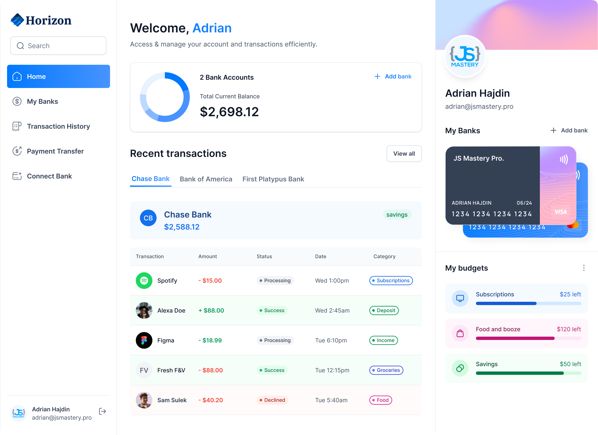
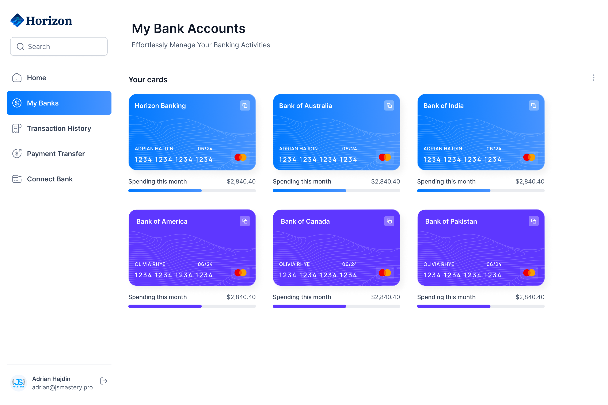
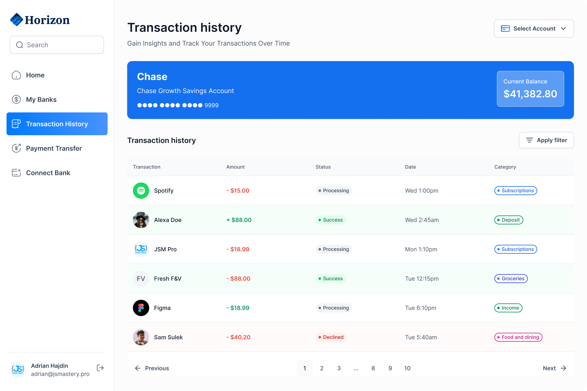

# Banking Platform


For Demo <br />
[Banking Platform Website Demo](https://horizon-banking-kohl.vercel.app/) <br />


<br/>


### Images of The Banking Platform Website:

#### Home


#### My Banks


#### Transactions History


For more Images please check the [project images](https://github.com/mohamedelmougy/horizon-banking/tree/main/public/images) folder from this repo or check the demo link. 


## Getting Started

First, run the development server:

```bash
npm i

then:
npm run dev
# or
yarn dev
# or
pnpm dev
```
## .env
```bash
#NEXT
NEXT_PUBLIC_SITE_URL=

#APPWRITE
NEXT_PUBLIC_APPWRITE_ENDPOINT=
NEXT_PUBLIC_APPWRITE_PROJECT=
APPWRITE_DATABASE_ID=
APPWRITE_USER_COLLECTION_ID=
APPWRITE_BANK_COLLECTION_ID=
APPWRITE_TRANSACTION_COLLECTION_ID=
NEXT_APPWRITE_KEY=

#PLAID
PLAID_CLIENT_ID=
PLAID_SECRET=
PLAID_ENV=
PLAID_PRODUCTS=
PLAID_COUNTRY_CODES=

#DWOLLA
DWOLLA_KEY=
DWOLLA_SECRET=
DWOLLA_BASE_URL=
DWOLLA_ENV=

```
Open [http://localhost:3000](http://localhost:3000) with your browser to see the result.

## 1. Tech Stack

- Framework: `Next.js`
- Language: `Typescript`
- Styling: `tailwindCSS & Shadcn`
- Form: `React Hook Form & zod`
- Router: `App Router`
- Linting: `ESLint`
- Backend: `Appwrite`